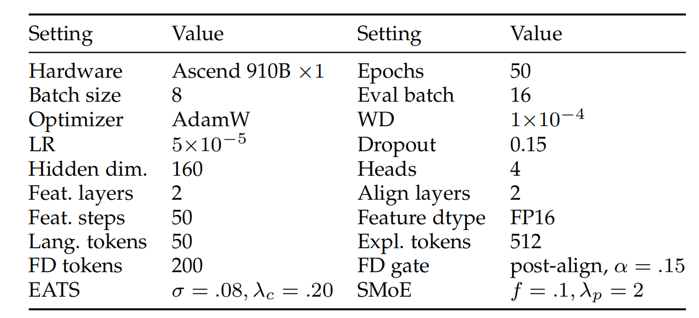

# AMID

AMID is a multi-agent framework for multimodal sentiment analysis based on explanation-guided representation learning, fine-grained temporal alignment, and agent-routed adaptive fusion.


## Abstract

Multimodal sentiment analysis (MSA) aims to infer sentiment polarity and intensity from the language, audio, and visual modalities. However, affective evidence can remain implicit in modality representations, the most informative modality can vary across samples, and explanation tokens and nonverbal sequences have different temporal resolutions. To address these issues, we propose AMID, a multi-agent framework that integrates representation learning driven by explanations, cross-modal temporal synchronization, and adaptive expert fusion. AMID first uses modality-specific Explanation Agents to convert audio and sampled video into structured evidence reports. Explanation Attention encodes these reports and connects their cue tokens with modality features, while a tri-modal Analysis Agent generates a Final Description and a sample-specific Fusion Weight. The Final Description reweights salient audio and visual tokens, and the Explanation Attention Temporal Synchronizer derives temporal anchors and reliability scores from explanation attention to synchronize the two nonverbal streams. Finally, Agent Routed Mixture-of-Experts fuses language, audio, and visual representations while retaining every modality above a routing floor. Experiments on CMU-MOSI, CMU-MOSEI, and CH-SIMS show that AMID achieves state of the art performance, with substantial leads in fine grained classification and regression while generalizing well.

## Files

- `train.py`: MOSEI data loading, training loop, validation/test evaluation, and metric logging.
- `model/model.py`: model assembly and forward path. The public class is `ModelA`.
- `model/units.py`: the `UnitA`--`UnitJ` blocks and the final three-path operation.


## Parameters



*Note.* LR denotes learning rate; WD denotes weight decay; Eval batch denotes the evaluation batch size. The final three-path operation uses `limit_x` and `scale_x`; all three paths are evaluated for every sample.

Default values are defined in `train.py`.

- `batch_size`: 8.
- `eval_batch_size`: 16.
- `epochs`: 50.
- `optimizer`: AdamW.
- `lr`: `5e-5`.
- `weight_decay`: `1e-4`.
- `hidden_dim`: 160.
- `heads`: 4.
- `feature_layers`: 2.
- `align_layers`: 2.
- `dropout`: 0.15.
- `ema_decay`: 0.997, starting from epoch 4.
- `scale_i`: 0.08.
- `gain_i`: 0.20.
- `limit_x`: 0.1.
- `scale_x`: 2.0.

## Reference

```text
Package A
```
